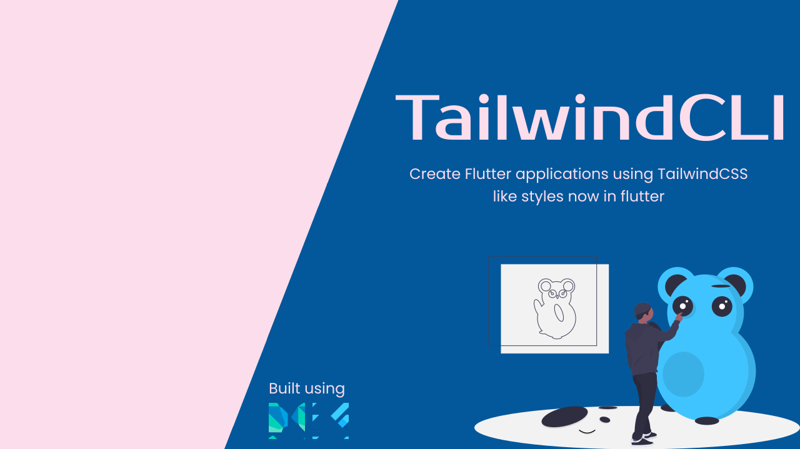

# Tailwind CLI

A simple yet awesome flutter package to generate and use TailwindCSS like styling in your flutter
projects.



### Inspiration

* [Tailwind CSS](https://tailwindcss.com/)
* [VelocityX](https://velocityx.dev)

#### Some Highlights

This will provide basic styling just like Tailwind provides in which it is providing
you ```Colors```, ```Gradient Colors```, Sizing ```(Padding, Margins)```,
```Roundness```, ```Shadows```, ```Font Sizes```, ```Font styling``` Etc.

## Future Plans

| Feature  | Status  | Addition/Changes  | From Version  |
|----------|:---------:|:-----------:|:---------------:|
| TwGrid Widget  | ⏳  | ➕  | ----  |
| TwImage Widget  | ⏳  | ➕  | ----  |
| SpaceX Widget  | ⏳  | ➕  | ----  |
| SpaceY Widget  | ⏳  | ➕  | ----  |
| Position Widget  | ⏳  | ➕  | ----  |
| Responsiveness  | ⏳  | ➕  | ----  |

## Getting Started
Install package
```bash
flutter pub add -d tailwind_cli
```

Now publish the ```tailwind.config.json``` file

```bash
flutter pub run tailwind_cli:init
```

Publishing ```tailwind.config.json``` file will create a config file for Tailwind styles.

Build / Generate tailwind styling

```bash
flutter pub run tailwind_cli:build
```

Add tailwind in your project's ```pubspec.yaml``` file under ```dependencies``` section

```yaml
# Tailwind
tailwind:
  path: tailwind
```

Now install generated tailwind styles in your project

```bash
flutter pub get
```

***Now your project is ready to use Tailwind styling***

### Note
***Please re-build ```tailwind``` styles every time you make changes in ```tailwind.config.json``` file*** 
```bash
flutter pub run tailwind_cli:build
```

## Features

This is mainly focused to provide you an easy way to style your pages and UI in your flutter
projects because as everyone knows that it takes developer to write a lot of code to achieve just a
small UI. So we are here to rescue you and provides you a lightning speed to build beautiful UI
without writing a lot of code.

## Detailed documentation

Coming Soon