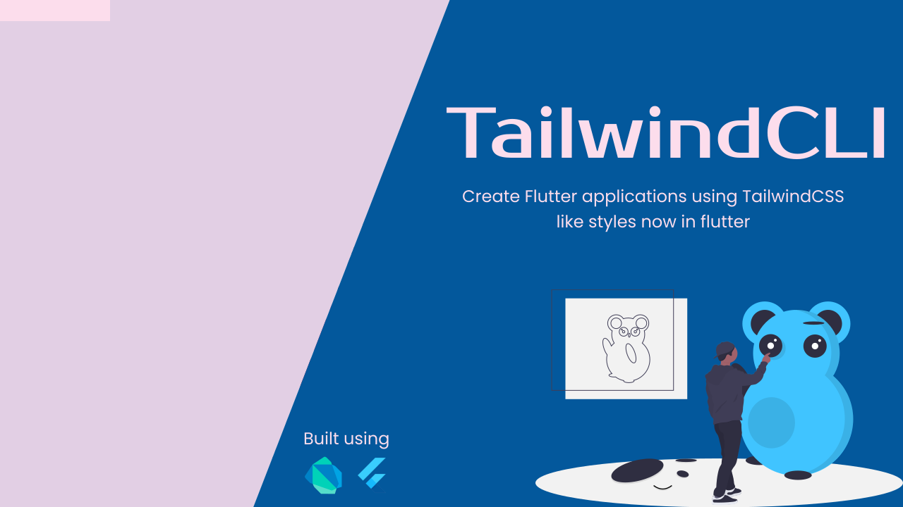

# Tailwind CLI v0.6.2

A simple yet awesome flutter package to generate and use TailwindCSS like styling in your flutter
projects.

## Inspiration

- [Tailwind CSS](https://tailwindcss.com/)
- [VelocityX](https://velocityx.dev)

## Some Highlights

This will provide basic styling just like Tailwind provides in which it is providing
you `Colors`, `Gradient Colors`, Sizing `(Padding, Margins)`,
`Roundness`, `Shadows`, `Font Sizes`, `Font styling` Etc.

## Want to dive in?

Know more about the package by visiting this
[Official Documentation](https://docs.devsbuddy.com/tailwind-cli/)

## Future Plans

| Feature                                     | Status | Addition/Changes | From Version  |
| ------------------------------------------- | :----: |:----------------:|:-------------:|
| `TwImage` Widget                            |   ⏳   |        ➕         |  In Progress  |
| `TwGrid` Widget                             |   ⏳   |        ➕         |  In Progress  |

---

## Support me

If you found this package helpful you can show support by clicking on the following button below and donating some amount to help me work on these projects frequently.

---

## Getting Started

Please check our Official Documentation for instruction on how to use this package in your Flutter apps.

Go to: **[Official Documentation](https://docs.devsbuddy.com/tailwind-cli/)**

## Features

As every flutter developer knows that each flutter application requires a lot of code to be written to achieve the best UI. I saw this issue and searching for the way which can
help us reduce the number of lines of code but get the same result as expected. I was aware of the UI libraries for the web development. In which one of the best is `tailwindcss`
but it is only available for the `html` and `css` which is really awesome and provides a great way to write clean and effective code for your application's UI. I searched for the
same which can be used in flutter but found nothing which is similar to `tailwindcss`. I know there is one package called `VelocityX` which does same thing but there are some
issues with that package. As i already mentioned my inspiration above in which I included `VelocityX`.

So I thought why I can't make this feature with mainly focusing on the UI in our flutter projects? For this I created this project and thankfully it worked.

### Highlights

| Performance      | Writing code                                         |
| ---------------- | ---------------------------------------------------- |
| 100% performance | 2x your code writing speed as it reduces code length |
| No heavy library | Write less produce more                              |
| Lightweight      | Increase your productivity by 200%                   |

### Widgets

- This project generates some widgets that can be used with the tailwind like stylies.
- You can also use other native widgets which can be converted to Tailwind Widget and inherit the tailwind styles.
- Few example widgets:
    - `TwButton` to create a button.
    - `TwColumn` a wrapper around a column widget.
    - `TwContainer` Flutter container widget with goodness of tailwind styles.
    - `TwPadding` Now adding padding is so simple.
    - `TwRow` Create rows with ease.
    - `TwStack` Manage stack widget with extension methods.
    - `TwText` now working with text widget is so simple with `TailwindCLI`.
    - [See more](https://docs.devsbuddy.com/tailwind-cli)

### Methods

There are several methods which can be used to build the tailwind like styles for any widget found in the flutter.

- **Paddings**: Adding padding is not an easy task for the Flutter projects as it requires a lot of code to be written for a simple padding.
    - But with this library you can add padding with just few characters.
- **Margins**: Same applies for the margins.
- **Text Colors**: We have a great pallete of colors which can be used for any kind of text widget with few characters of code.
    - For example `Text("Flutter is awesome").text.red500.render()`.
    - See that we only need to call the color name to set the color for the text widget.
- **background Colors**: Same color pallete can be used for background color for any widget with few characters of code.
    - For example `Container(height: 500, width: 500).container.red500.render()`.
    - See that we only need to call the color name to set the background color for the container widget.
- [See more](https://thedevsbuddy.github.io/tailwind_cli)

## Detailed documentation

You can check the official documentation by visiting this url: [Visit Official Documentation](https://thedevsbuddy.github.io/tailwind_cli/)

**_Note: This documentation is on the initial stage which will be fully available soon._**

## Contribution

Your contribution is always welcome and will be appreciated.

Follow this guidelines to contribute:
[Contribution Guidelines](/CONTRIBUTION.md)
